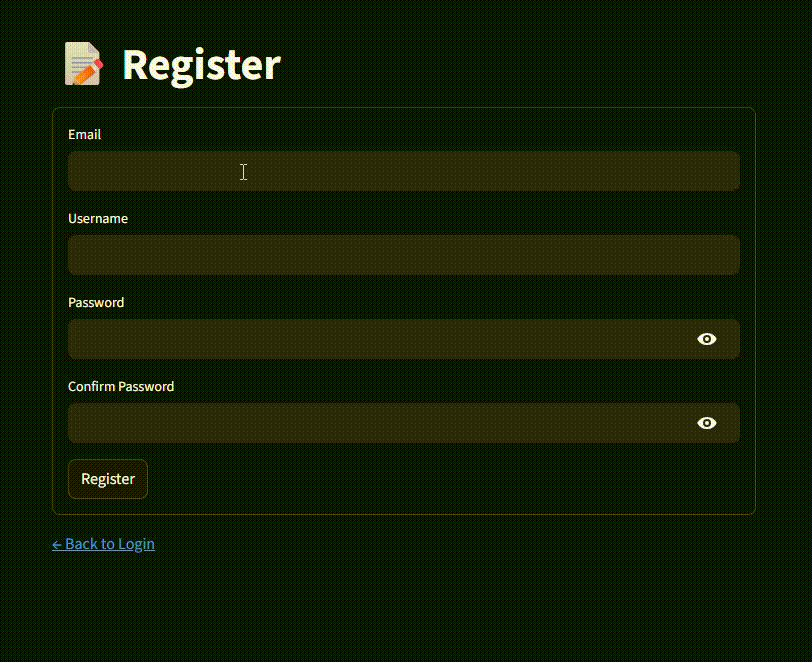
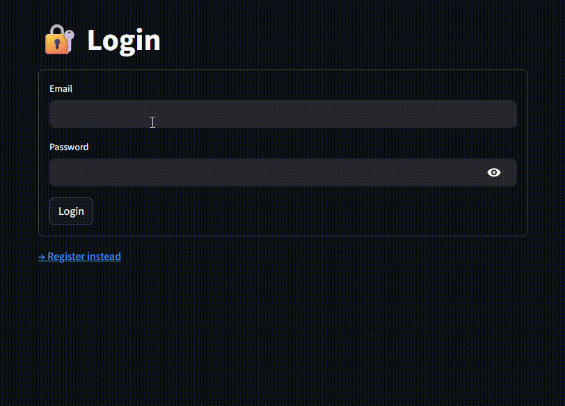
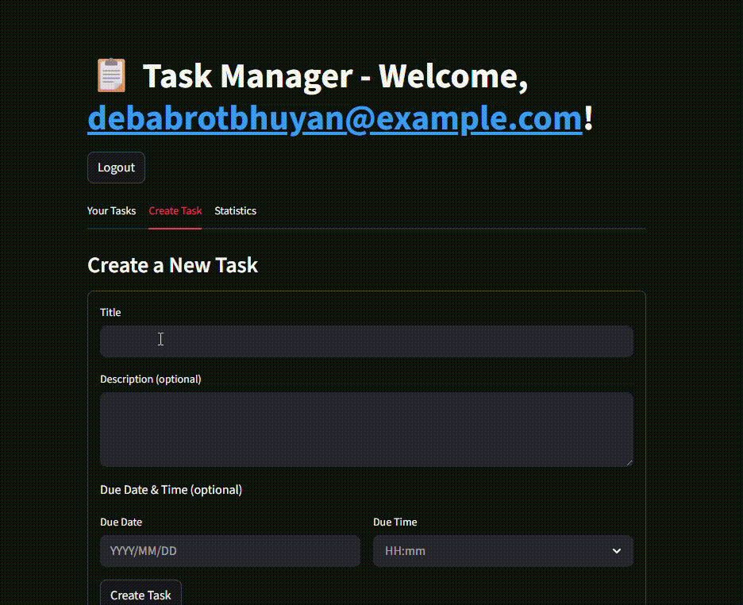

# 🚀 Task Manager Microservice

A modern, secure, and scalable task management microservice built with **FastAPI** (backend) and **Streamlit** (frontend), powered by **PostgreSQL** and secured with **JWT authentication**.

---

## 🎥 Demo

Check out the live functionality in action:

| Action | GIF |
|-------|-----|
| **User Registration** |  |
| **User Login** |  |
| **Create & View Tasks** |  |

---

## ✅ Features

- 🔐 **User Authentication**
  - Register, Login, Logout
  - Token refresh using JWT
  - Password hashing with `argon2`
- 📝 **Task Management (CRUD)**
  - Create, Read, Update, Delete tasks
  - Secure access control per user
- 🔒 **Security**
  - JWT-based stateless authentication
  - Input validation via Pydantic
- 🧪 **Tested & Reliable**
  - Unit tests using `pytest`
  - Async test suite support
- 🐳 **Containerized**
  - Docker & Docker Compose ready
  - Easy setup and deployment

---

## 🛠️ Tech Stack

### Backend
- **FastAPI** – Modern Python web framework with automatic OpenAPI/Swagger docs
- **PostgreSQL** – Robust relational database
- **SQLAlchemy ORM** – Database interactions
- **Pydantic** – Data validation and settings management
- **Alembic** – Database migrations
- **PyJWT & Passlib** – JWT token generation and password hashing
- **Uvicorn** – ASGI server

### Frontend
- **Streamlit** – Simple, interactive UI for demo and usability

### DevOps
- **Docker & Docker Compose** – Containerization and orchestration
- **Makefile** – Common commands automation

---

## 📁 Project Structure

```bash
.
├── app/                    # FastAPI backend
│   └── backend/
│       ├── core/           # Config, DB, security
│       ├── models/         # SQLAlchemy models
│       ├── schemas/        # Pydantic DTOs
│       ├── routers/        # API endpoints
│       ├── services/       # Business logic
│       └── utils/          # Utilities (e.g., logger)
├── frontend/               # Streamlit frontend
│   └── app/main.py
├── migrations/             # Alembic migration scripts
├── docker-compose.yml      # Services orchestration
├── Dockerfile              # Backend container image
├── Makefile                # Handy CLI commands
├── requirements.txt        # Python dependencies
└── entrypoint.sh           # Container startup script
```

---

## 🚀 Getting Started

### Prerequisites

- [Docker](https://docs.docker.com/get-docker/) and [Docker Compose](https://docs.docker.com/compose/install/)
- Python 3.9+
- `pip` or `poetry`

---

### 1. Build & Run the Backend (via Docker)

```bash
# First time setup (builds images and runs migrations)
make up-build

# Subsequent runs (faster startup)
make up
```

This starts:

> - FastAPI backend on `http://localhost:8000`
> - PostgreSQL on `localhost:5432`
> - Swagger UI at `http://localhost:8000/docs`

---

### 2. Run the Frontend (Streamlit)

```bash
# Create virtual environment (optional but recommended)
python -m venv .venv
source .venv/bin/activate   # Linux/Mac
# or
.venv\Scripts\activate      # Windows

# Install Streamlit
pip install streamlit

# Launch the frontend
streamlit run frontend/app/main.py
```

> The Streamlit app runs on `http://localhost:8501`

---

## 🔮 Future Improvements

- ✅ **Multi-tenancy support** – Isolate data across organizations
- ✅ **Role-Based Access Control (RBAC)** – Admin, editor, viewer roles
- ✅ **HMAC request signing** – Enhanced API security
- ✅ **Rate limiting & logging**
- ✅ **CI/CD pipeline (GitHub Actions)**
- ✅ **Swagger customization & request examples**

---

## 📄 License

MIT License. See `LICENSE` for details.

---

## 🙌 Contributing

Feel free to fork, open issues, or submit pull requests!

---

> Made with ❤️ using FastAPI, Streamlit, and PostgreSQL  
> Let your tasks be managed securely and beautifully. 🧩

---
